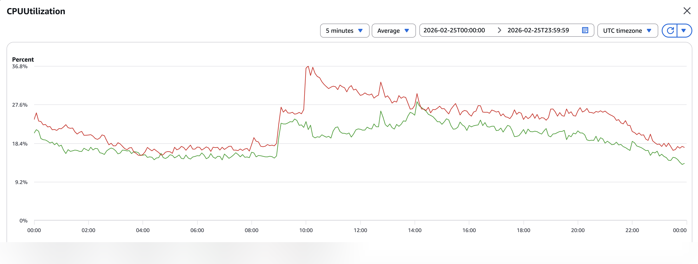
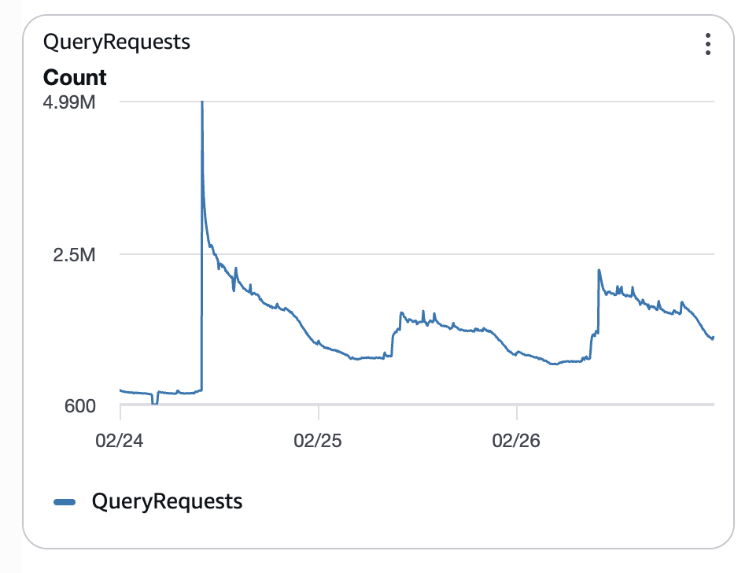
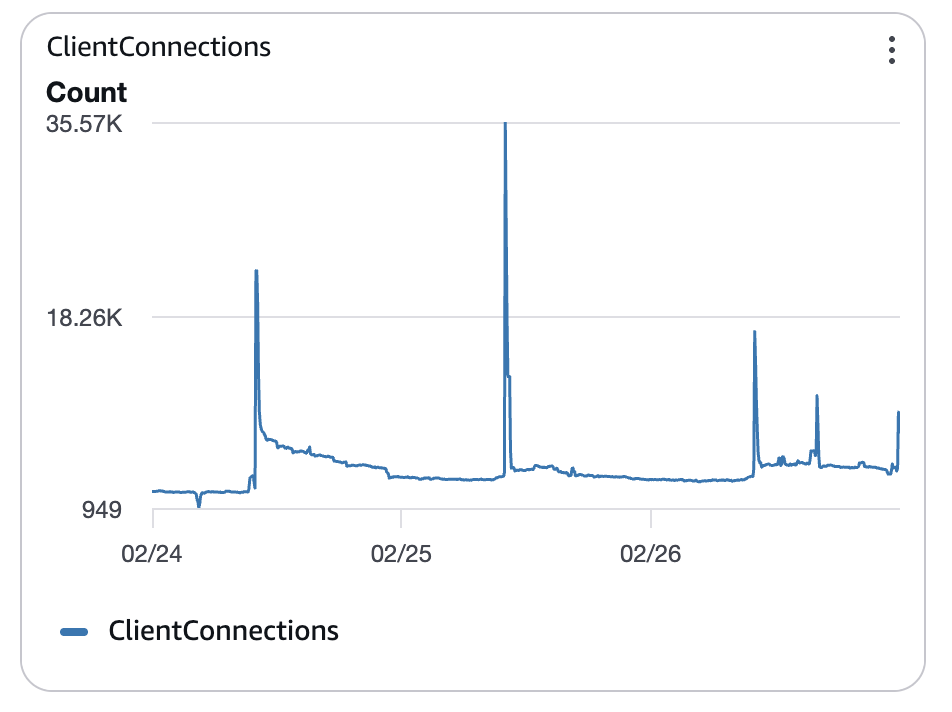
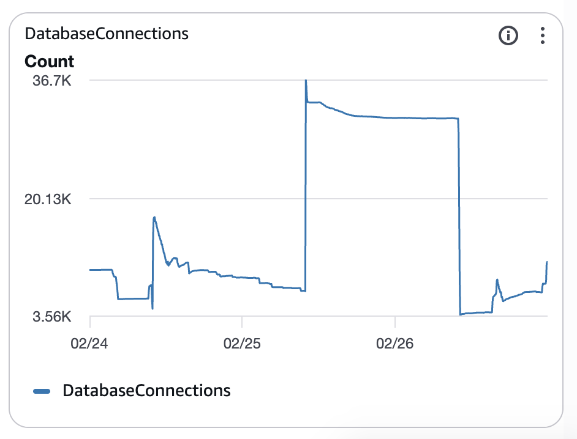
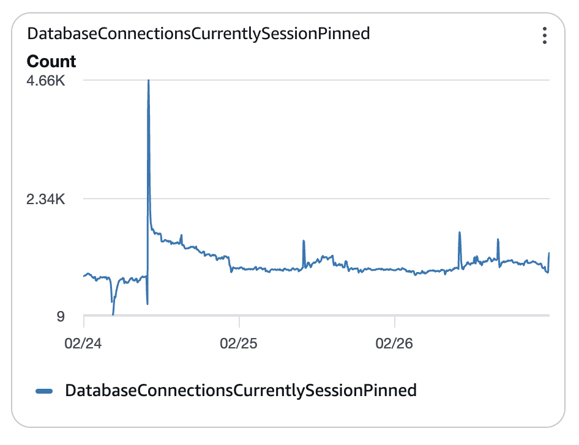
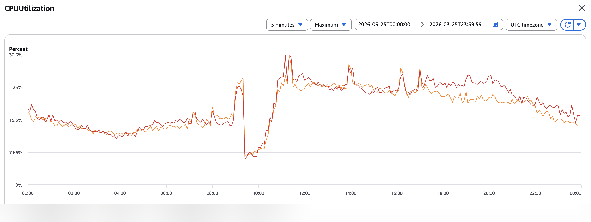
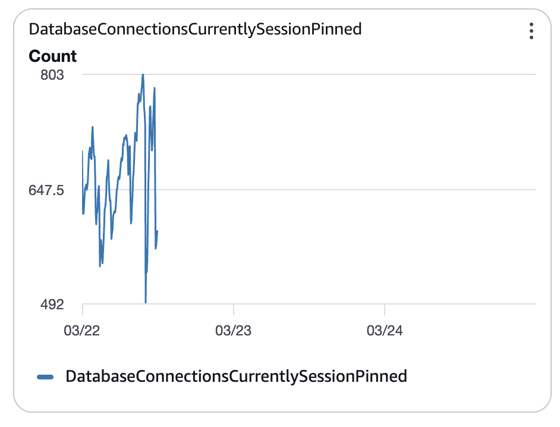
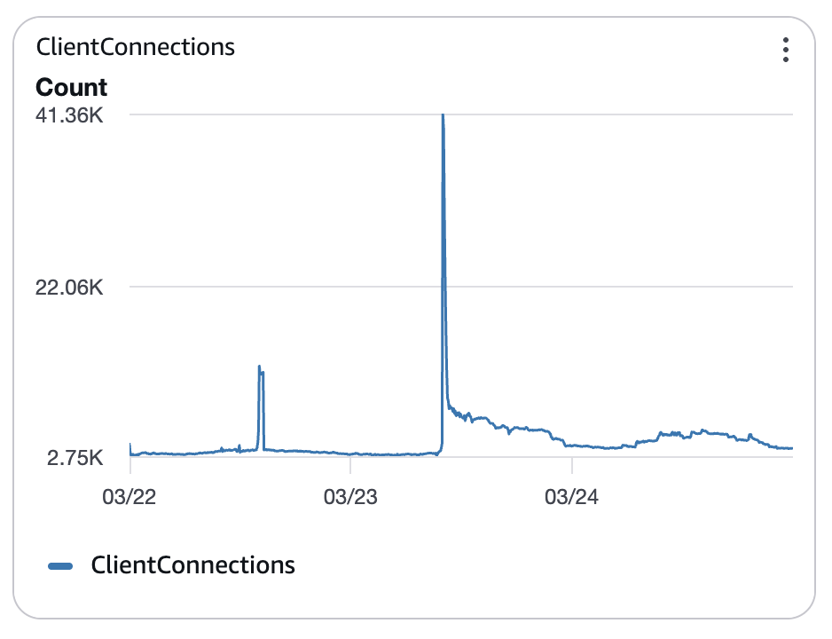
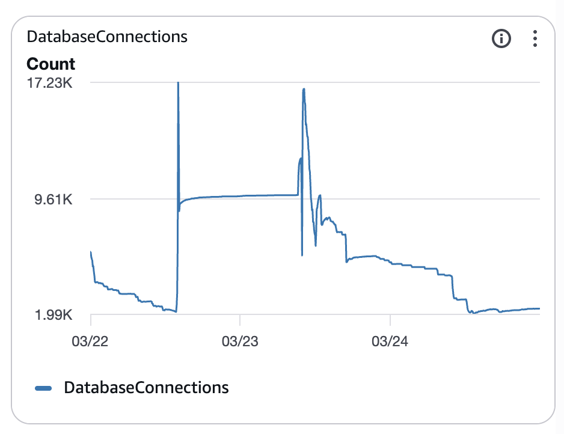

+++
title = "How Large Queries Broke Our CPU Balance Across Aurora Read Replicas"
date = "2026-04-10"
description = "An investigation into uneven CPU distribution among Aurora MySQL read replicas — caused by RDS Proxy connection pinning triggered by large queries."
tags = [
    "aws",
    "mysql",
    "rds"
]
+++

We've been having troubles with our Aurora MySQL cluster for a while: CPU distribution among read replicas was imbalanced, which led to application performance degradation.

In this post I will share how we tracked down the root cause, solved it and what RDS Proxy had to do with it.

## The Problem

The system in question is a read-heavy service that uses Aurora MySQL as a database with RDS Proxy in between to allow faster failovers and safer maintenance activities.
Traffic is stable most of the time, but there are a few days per month when we expect a surge of read operations to the service, due to which we scale up our Aurora cluster with read replicas preliminarily for a fixed period of time.
However, we've been seeing an issue with the CPU distribution among the replicas: it was completely uneven, almost random, some nodes were running on almost 99%, some on just a few.

Naturally it led to poor system stability: regular spikes of timeouts from the service to the database, overall average service latency increase, alerts and most importantly - poor user experience.



_(unfortunately the problematic nodes were already scaled down at the time of me writing this post, and I haven't found a reliable way to find CPU metrics in CloudWatch for one of the "bottom" nodes, so I had to use two available but not so distant ones for a screenshot)_

For the record, the throughput on the database at the time:



The replicas were running on the same instance types and in a single availability zone, so it certainly wasn't a hardware or network issue.
There was one good thing though: replicas CPU distribution correlated closely with their select queries throughput.
It was a problem of selecting the right replica for the query - we weren't doing a good job at it, making some of the replicas hotter than the rest, so we had to understand why.

## The Band-Aid That Kept Falling Off

We found that reestablishing the connection pool helped with traffic distribution among the replicas, but it only worked until it didn't - the imbalance kept appearing afterward every single time within a few hours.
Rolling the service repeatedly and keeping our DevOps and SRE teams on high alert obviously didn't scale and make anyone happy, but at least we could go through the hot periods of the month when read traffic to the system was the highest.

## Down the Rabbit Hole

After numerous investigations in CloudWatch and other metrics we started thinking that it was RDS Proxy's fault.
Not only did we scale up the cluster manually before the expected traffic spikes, our cluster also has autoscaling enabled by CPU.
We made an assumption that maybe when one of the replicas was added, RDS proxy for some reason didn't choose it as a target for the read queries and made them "stick" to already existing ones.

Though the assumption couldn't explain every observable behavior, we decided to continue with it as we didn't really have any other options on the table.
I guess sometimes in such "dead-ends" you just need to do something in order for new ideas and thoughts to appear. So we tried.

### What Didn't Work

RDS Proxy sits between your application and the database cluster and manages a pool of connections on your behalf — your app connects to the proxy, and the proxy decides which backend replica to route each query to.
This is supposed to give you faster failovers, connection reuse, and (of course) a more even spread of traffic.
If there is a new replica in the cluster - it should automatically start using it as a new upstream destination. But maybe it didn't work?

Knowing that CPU distribution usually improves for some time after a rollout, we decided to "help" the proxy by restarting the connection pools on the application side each time there was a new replica in the cluster.
Aurora MySQL has a special `information_schema` under which there's a table called `replica_host_status`. The table contains data about the available replicas and has the following columns:

- `CPU` — CPU percentage usage of the replica host
- `IS_CURRENT` — whether the replica is current
- `LAST_UPDATE_TIMESTAMP` — time of the last update, used to determine if a record is stale
- `REPLICA_LAG_IN_MILLISECONDS` — replica lag in milliseconds
- `SERVER_ID` — the ID of the database server
- `SESSION_ID` — the ID of the database session, used to determine if an instance is a writer or reader

Periodically querying this table and comparing the results with previous invocations could help us identify replica count changes.
We updated our application logic to monitor the table and restart the connection pool to RDS Proxy once a change is identified.

Well... it didn't really help. The so-called "improvement" was no different from rolling the service from time to time. Again a band-aid and not a real solution.

### The Breakthrough: RDS Proxy Session Pinning

At some point we thought that we should just remove the RDS Proxy from the setup completely, just to see if it helps. Funnily enough, as we'd later discover, it would've probably helped, so I'm really glad we didn't try it as just removing RDS Proxy didn't sound like a real solution to me. The actual root cause was still missing.

Concentrating the effort on RDS Proxy made us look at its metrics as well, and we noticed the following anomaly.

During the investigated traffic peaks the number of connections to the proxy (ClientConnections) was lower than the number of connections to the database (DatabaseConnections).
Kind of contrary to the way any proxy is supposed to operate, right?





After looking again at the RDS Proxy documentation, I noticed a [page](https://docs.aws.amazon.com/AmazonRDS/latest/UserGuide/rds-proxy-pinning.html) dedicated to connection pinning.
Normally the proxy freely multiplexes your application's requests across all available connections to the database, but when a connection to the proxy becomes "pinned" it gets stuck to a single database instance for the rest of its lifetime, bypassing the load-balancing behavior you're actually counting on.

And we did have connection pinning on our proxy:



### Finding the Smoking Gun

The documentation includes the conditions under which RDS Proxy pins the connection for MySQL/MariaDB specifically, such as setting session level variables, using table locks, executable comments, prepared statements and more.
We checked the code and the MySQL client we use, but none of the reasons fit - we used literally nothing from the pinning causes.
But we noticed the following paragraph on the same page:

> **Conditions that cause pinning for all engine families**
>
> The proxy pins the session to the current connection in the following situations where multiplexing might cause unexpected behavior:
>
> * Any statement with a text size greater than 16 KB causes the proxy to pin the session.

Well that looks like fun.

### Measuring the Problem

Even though at first it sounded surreal, because 16 KB is actually a lot of SQL, we anyway decided to put a metric on the query byte size.
And it quickly revealed the fact we quite often have queries that are larger than 16 KB in size, some are even jumping up to 50 KB!

We identified the "suspect" queries in the application code. Their size was actually caused by large `WHERE IN` clauses, which included **up to a thousand** unique user IDs to filter by. Something along the lines of:

```sql
SELECT id, name, ...
FROM users
WHERE id IN (
    '550e8400-e29b-41d4-a716-446655440000',
    'f47ac10b-58cc-4372-a567-0e02b2c3d479',
    '6ba7b810-9dad-11d1-80b4-00c04fd430c8',
    -- ... ×1000
)
```

## The Fix

This was the simplest stage. We updated the application code to prefer launching many smaller `select` statements with narrower `where in` clauses in parallel, rather than launching a single large query, essentially turning a single large batch into many smaller ones, as long as each query stayed under 16 KB.

And it just did the trick.

## The Result

We were very happy with the results.

CPU gap between the nodes "narrowed":


Connection pinning completely disappeared:


And finally the number of client connections was higher than the number of database connections, which is exactly how it's supposed to work:




## Takeaways

Apart from just RTFM, there are a few points we learned here:

1. RDS Proxy is not an easy "set and forget" service — understanding pinning behaviour can be crucial to the system stability;
2. It is worth monitoring your SQL query byte size, not just their throughput or latency.

